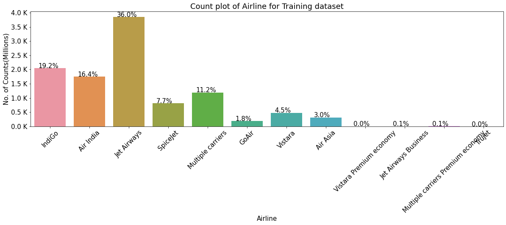

# Flight_Price-Prediction

Here we Predict flight price base on following inputs or Features. 
1. Where from user take a flight i.e Source of traval
2. To Where he want to go ie. Destination of Traval.
3. Day of Departure
4. Day of Arrival
5. Stopage i.e To traval from Source To Destination how many Stop user wants.
6. Airline company. Ie Which Airline user want to travel.

From above Features we Generate another featurs like,
1. Journey_day
2. Journey_month
3. Dep_hour
4. Dep_min
5. Arrival_hour
6. Arrival_min
7. Duration_hours
8. Duration_mins

And Convert all Categorical Features into Numerical using One-Hot Encoding.

### All Airlines

### All Source

Like this type of inputs or features we predict flight price.
And Deploy it on severs.

