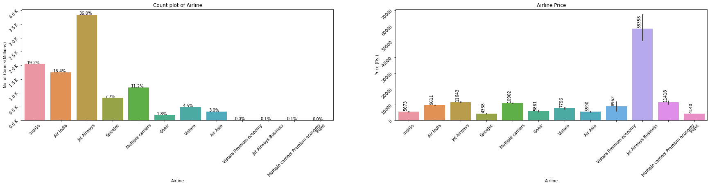
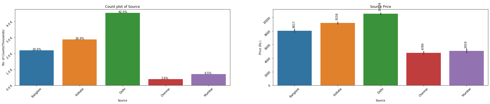

# Demo
[Demo link](https://predict-flight-price-api.herokuapp.com/)

# Flight_Price-Prediction

Here we Predict flight price base on following inputs or Features. 
1. Where from user take a flight i.e Source of traval
2. To Where he want to go ie. Destination of Traval.
3. Day And Time of Departure
4. Day And Time to Arrival
5. Stopage i.e To traval from Source To Destination how many Stop user wants or that flight takes.
6. Airline company. I.e From which Airline company user want to travel.

From above Features we Generate another featurs like,
1. Journey_day
2. Journey_month
3. Dep_hour
4. Dep_min
5. Arrival_hour
6. Arrival_min
7. Duration_hours
8. Duration_mins

And Convert all Categorical Features into Numerical using One-Hot Encoding.

### ALL Airlines

### ALL Source

### ALL Destinations

### ALL Routes

### ALL Total_stops

### Price Over days in Months

### Dep_Houre

### Arrivel Houre

### Duration Hours Count

### Duration Hours

### Heat Map

### Top 20 Features

Like this type of inputs or features we predict flight price.
And Deploy it on severs.

