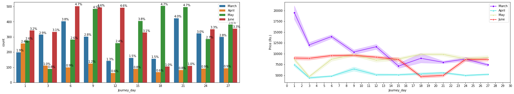

# Demo
[Demo link](https://predict-flight-price-api.herokuapp.com/)

# Flight_Price-Prediction

Here we Predict flight price base on following inputs or Features. 
1. Where from user take a flight i.e Source of traval
2. To Where he want to go ie. Destination of Traval.
3. Day And Time of Departure
4. Day And Time to Arrival
5. Stopage i.e To traval from Source To Destination how many Stop user wants or that flight takes.
6. Airline company. I.e From which Airline company user want to travel.

From above Features we Generate another featurs like,
1. Journey_day
2. Journey_month
3. Dep_hour
4. Dep_min
5. Arrival_hour
6. Arrival_min
7. Duration_hours
8. Duration_mins

And Convert all Categorical Features into Numerical using One-Hot Encoding.

### ALL Airlines

- There are total 12 Unique Airlines. which is ['IndiGo', 'Air India', 'Jet Airways', 'SpiceJet', 'Multiple carriers', 'GoAir', 'Vistara', 'Air Asia', 'Vistara Premium economy', 'Jet Airways Business', 'Multiple carriers Premium economy', 'Trujet']
- Most used flight by user are Jet Airways, IndiGo, Air India.
- And most expensive flight is Vistara Premium Economy.

### ALL Source

- There are total 5 Unique Source of travel. which is ['Banglore', 'Kolkata', 'Delhi', 'Chennai', 'Mumbai']
- Most user travel from Delhi, Kolkata, Banglore.
- And Delhi, Kolkata, Banglore Source have a high price as compare to others. 

### ALL Destinations

- There are total 6 Unique Destination of travel. which is ['New Delhi', 'Banglore', 'Cochin', 'Kolkata', 'Delhi', 'Hyderabad']
- most of the user Travel To Cochin, Banglore, Delhi.
- And New Delhi, Cochin, Banglore Destination have a high price as compare to others.

### ALL Routes

- There are total 128 Unique Route paths.
- Most of the Airline Route path is DEL-BOM-COK, BLR → DEL, CCU → BOM → BLR

### ALL Total_stops

- There are total 5 types Unique Stops during Travel. which is ['non-stop', '2 stops', '1 stop', '3 stops', 'missing', '4 stops'].
- Most of the Airline take at least one stop during travel.
- And as Stops Increase Flight Price will also Increases.

### Price Over days in Months

- All Journey year are 2019.
- Fight Price high in March Month till 13 March in 2019.
- In whole April month Fight Price is low as Compare to other Months.

### Dep_Houre

- In mid night Flight Price is less as compare to day.
- From 1 Am to 4-5 Am Flight Price is low.

### Arrivel Houre

### Duration Hours Count

### Duration Hours

- From above plots we say that 22.5% Travel duration Takes 2 Hours.
- And 50.0% Travel duration takes 8 Hours.
- There are very few flights which take more than 32 hours.
- And As Travel duration increase Flight Price also increases.

### Heat Map

### Top 20 Features

Like this type of inputs or features we train a model and predict flight price.
And Deploy it on server.

